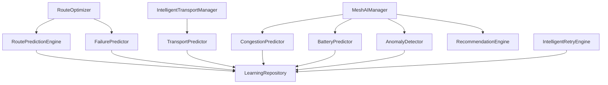

# Enterprise AI-Assisted Mesh Intelligence Architecture

Mesh Link has been upgraded with an offline, on-device intelligence layer. This allows the mesh network to continuously self-optimize without relying on cloud servers.

## TinyML Ready Architecture
Currently, the prediction engines (e.g. `RoutePredictionEngine`, `CongestionPredictor`) use mathematical models, EWMA (Exponentially Weighted Moving Averages), and heuristical derivatives. 
By placing these inside isolated interface-like structures, the architecture is **TinyML Ready**. Future updates can easily swap these Kotlin-based predictors for a `TensorFlow Lite` or `ONNX` model loaded via Android's NNAPI.

## Key Modules
1. **MeshAIManager**: Central orchestrator. Emits the live Mesh Health Score (0-100) and actionable text recommendations.
2. **LearningRepository**: Fast, concurrently-accessed cache mapped to disk via SharedPreferences.
3. **AnomalyDetector**: Looks for 10x spikes in expected traffic patterns (DDoS, Broadcast storms).
