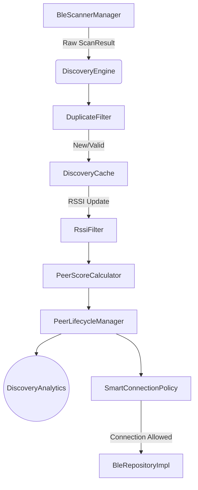

# Discovery Engine Architecture

This document details the new Intelligent Discovery Engine introduced in Phase E2.

## Subsystem Overview

The new engine moves away from monolithic, "always-on" scanning into an adaptive, battery-aware architecture.

## Key Components

1. **DiscoveryEngine**: The central orchestrator that hooks into raw Bluetooth callbacks and routes them through the filtering and scoring pipeline.
2. **DiscoveryScheduler**: Implements windowed scanning based on network stability and device power state (via `BatteryAwareScanner`).
3. **DuplicateFilter**: Drops redundant advertisements from the same node within a 2-second window to save CPU cycles and prevent log flooding.
4. **PeerScoreCalculator**: Normalizes RSSI and applies penalties for staleness and connection failures to output a deterministic 0-100 score.
5. **SmartConnectionPolicy**: Uses exponential backoff (starting at 1s, doubling up to 30s) plus jitter to prevent thundering herd reconnections when a node drops.
