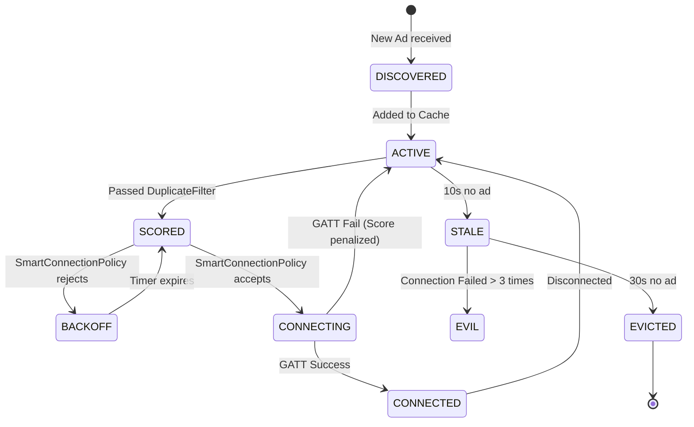

# Discovery State Machine

The Intelligent Discovery Engine manages the following lifecycle for each peer:

## State Definitions

- **DISCOVERED**: The raw MAC address and mesh ID were decoded from an advertisement.
- **ACTIVE**: The node is recorded in the `DiscoveryCache`.
- **SCORED**: The node has been ranked based on RSSI, stability, and capabilities.
- **BACKOFF**: The node is waiting in exponential backoff to prevent thundering herd connections.
- **CONNECTING**: The engine has initiated a GATT connection request.
- **CONNECTED**: The GATT connection is active and stable.
- **STALE**: The node hasn't been seen in the recent scan window.
- **EVICTED**: The node has been removed from memory.
- **EVIL**: The node consistently fails to connect or causes OS stack crashes, so it is ignored.
