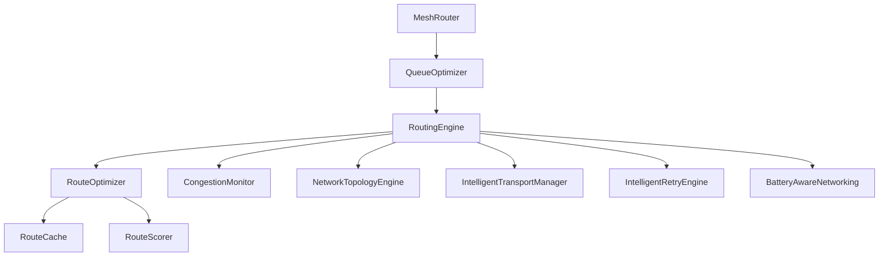

# Enterprise Network Architecture

## Overview
Phase E7 upgrades Mesh Link from a simple reactive router into a **Self-Optimizing Distributed Network Engine**.

## Key Architectural Upgrades

### 1. Priority Queueing (`QueueOptimizer.kt`)
Instead of synchronous flooding, all packets are now pushed to a Priority Queue before dispatch.
- **Priority 1**: SOS / Emergency
- **Priority 2**: Voice / Video (Real-time Media)
- **Priority 3**: Standard Messaging
- **Priority 4**: Background File Sync

### 2. Multi-Path predictive Routing (`RouteOptimizer.kt`)
Rather than waiting for a route to break, `RouteOptimizer` monitors RSSI degradation and packet loss velocity. If it predicts a route failure within seconds, it proactively fails over to a secondary candidate path.

### 3. Adaptive Broadcasting (`RoutingEngine.kt`)
O(N²) flooding destroys massive networks. Broadcasts are now regulated probabilistically by the node's `BatteryAwareNetworking` module. 

### 4. Partition Recovery (`NetworkTopologyEngine.kt`)
Detects when disjoint mesh islands merge and orchestrates a prioritized sync, preventing sudden massive broadcast storms.
