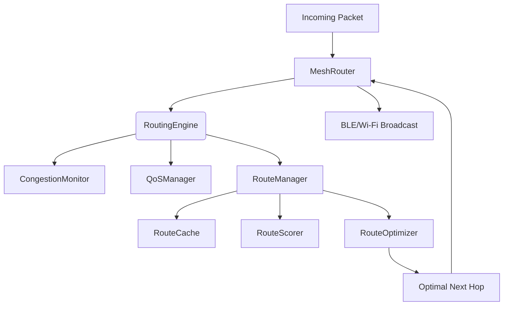

# Routing Engine Architecture

This document describes the Phase E3 Adaptive Mesh Routing Engine.

## Overview
The legacy routing system relied heavily on static TTL and broadcast flooding. The new architecture introduces intelligent, weighted routing through a centralized `RoutingEngine` that connects directly into the existing `MeshRouter` facade.

## Core Components
- **RoutingEngine**: The facade orchestrator for routing logic. Ensures packet deduplication and prevents routing loops.
- **RouteManager**: Manages route lifecycles and historical tracking.
- **RouteOptimizer**: Provides dynamic TTL adjustment based on network size and queries the cache for the best possible next hop (or backup hops).
- **RouteCache**: Uses `ConcurrentHashMap` to store live routes and uses `RouteHealthMonitor` to evict stale paths automatically without manual polling loops on the main thread.
