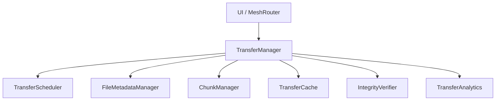

# Transfer Architecture

This document describes the Phase E4 Enterprise File Transfer Engine.

## Overview
The legacy `MediaTransferManager` was a monolithic class that buffered incoming chunks purely in RAM using ConcurrentHashMaps. It lacked persistence, resumability, and could easily cause Out-Of-Memory (OOM) errors on large files. The new architecture is a modular, disk-backed engine supporting parallel, prioritized, and resumable transfers.

## Core Components
- **TransferManager**: The central orchestrator. It handles the `sendPacket` / `receivePacket` lifecycle, ACK/NACK signaling, and timeout monitors.
- **TransferScheduler**: Manages `TransferSession` states and enforces a Priority Queue. `CRITICAL` transfers (e.g. SOS) are allowed to preempt `LOW` priority transfers (e.g. background media sync).
- **TransferCache**: Staging cache. Incoming Base64 chunks are immediately written to disk (in `mesh_transfer_staging/`), eliminating memory bottlenecks.
- **ChunkManager**: Dynamically reads slices of source files. Avoids loading the entire file into memory before encoding.
- **IntegrityVerifier**: Validates SHA-256 checksums incrementally or during assembly to ensure the final payload is bit-perfect.
