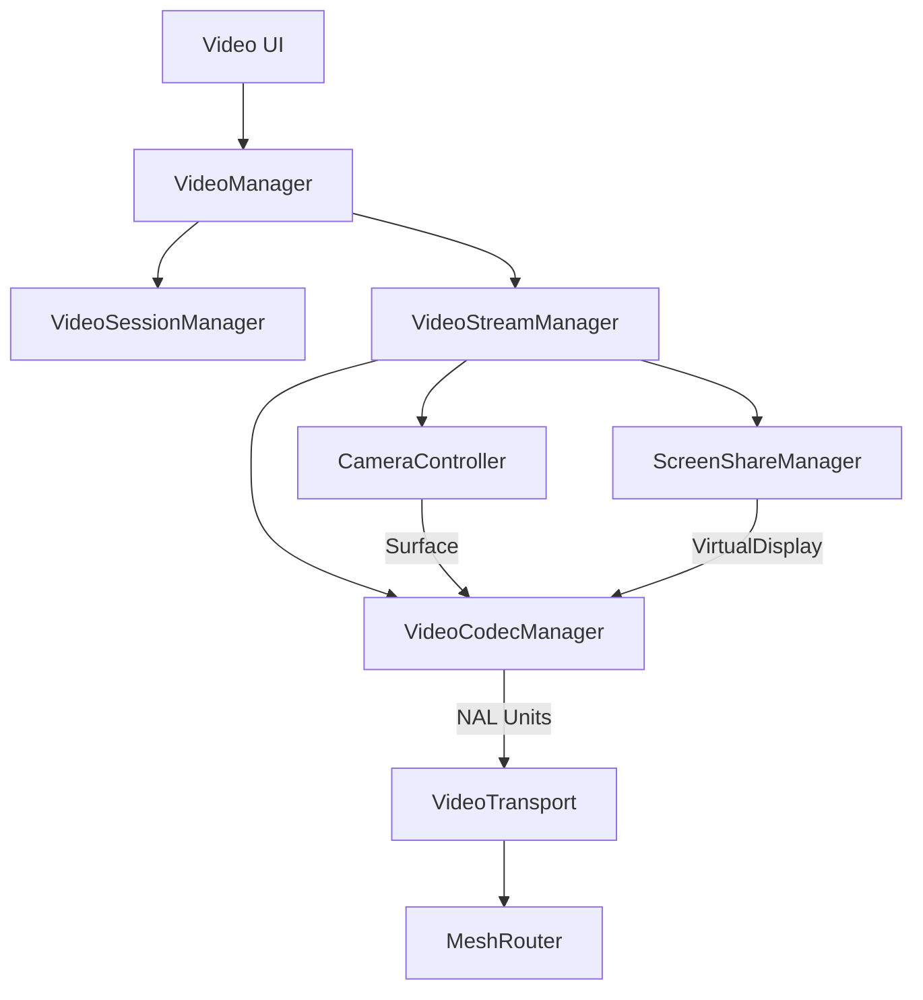

# Video Engine Architecture

This document describes the Phase E6 Enterprise Video Communication Engine.

## Overview
The Video Engine leverages Android's hardware `MediaCodec` and `CameraX` to provide real-time, zero-copy video streaming over the Mesh Link hybrid network.

## Core Components
- **VideoManager**: The facade for the Video Engine. Exposes APIs like `startCall`, `acceptCall`, `toggleCamera`, and `toggleScreenShare`.
- **VideoStreamManager**: Orchestrates the pipeline. Binds the camera, sets up the encoder, and handles frame routing. Can dynamically adjust resolution/FPS based on packet loss (via KeyFrame requests).
- **CameraController**: Uses CameraX to capture frames. Instead of `ImageAnalysis`, it pipes the raw sensor output directly into a `Surface` provided by `MediaCodec`, avoiding uncompressed YUV byte array copies on the CPU.
- **ScreenShareManager**: Uses Android's `MediaProjection` API to capture the device screen and pipe it directly to the encoder's `Surface`.
- **VideoCodecManager**: Wraps `MediaCodec`. Configured primarily for `H.265` (HEVC) for maximum compression efficiency. Extracts NAL units to send over the network, and decodes incoming NAL units directly to a `SurfaceView`.
- **VideoTransport**: Bridges the raw NAL units with the `MeshCryptoManager` for AES-GCM encryption before handing them to `MeshRouter` for transmission.
