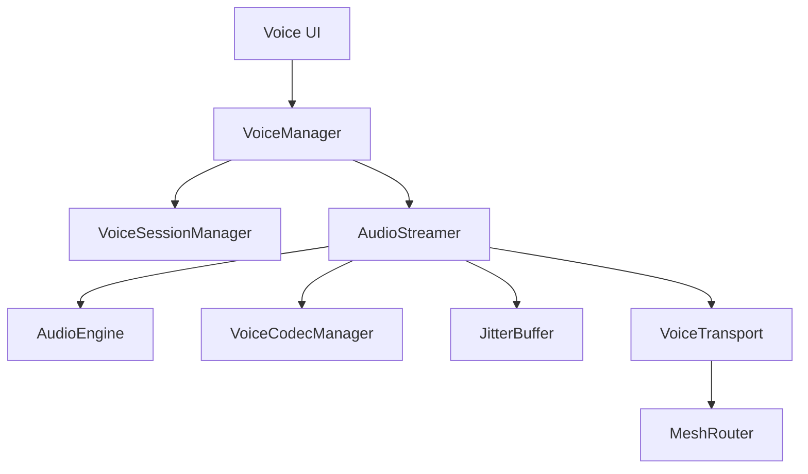

# Voice Engine Architecture

This document describes the Phase E5 Enterprise Voice Communication Engine.

## Overview
The Voice Engine replaces the monolithic "record-then-send" approach with a real-time, low-latency streaming architecture suitable for Live Calls and Push-to-Talk (PTT) over offline mesh networks.

## Core Components
- **VoiceManager**: The facade that exposes high-level APIs (`startCall`, `acceptCall`, `endCall`). Handles routing of incoming `VOICE_SIGNAL` packets.
- **AudioEngine**: Wraps Android's `AudioRecord` and `AudioTrack`. Enables Acoustic Echo Cancellation (AEC), Noise Suppression (NS), and Automatic Gain Control (AGC) at the hardware level.
- **AudioFocusManager**: Requests and abandons audio focus to gracefully handle incoming normal phone calls, media playback, and Bluetooth SCO routing.
- **VoiceCodecManager**: Utilizes `MediaCodec` for AAC encoding/decoding. Dynamically adjusts bitrates based on transport constraints.
- **JitterBuffer**: A Priority Queue-based buffer that reorders UDP-like Mesh frames arriving out of sequence, minimizing robotic audio artifacts.
- **VoiceTransport**: Encrypts raw AAC frames using AES-GCM and bridges them to the `MeshRouter` for transmission over BLE or Wi-Fi Direct.
