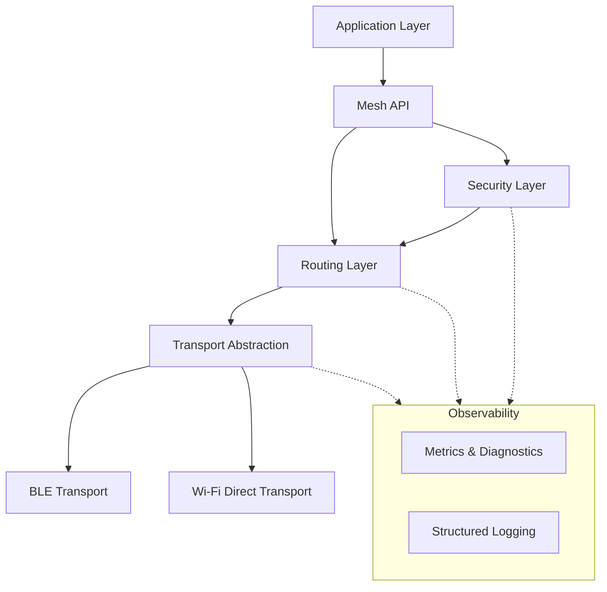

# Mesh Link V3.0 Architecture

This document describes the high-level architecture, module responsibilities, layered design, and data flow of Mesh Link V3.0.

## High-Level Architecture

Mesh Link V3.0 is a decentralized, peer-to-peer communication framework designed primarily for Android devices using BLE (Bluetooth Low Energy) and Wi-Fi Direct. The architecture is modular and highly decoupled to ensure maintainability, testability, and scalability.



## Layered Design

The system follows a strict layered architecture:

1.  **Application Layer:** The host application integrating Mesh Link. It uses the public API to send and receive messages.
2.  **API Layer:** The public-facing interfaces (e.g., `MeshManager`, `MeshClient`). It handles configuration and lifecycle management.
3.  **Security Layer:** Responsible for payload encryption, key exchange, session management, and replay protection.
4.  **Routing Layer:** Manages the mesh topology, multi-hop forwarding, route discovery, and packet deduplication.
5.  **Transport Abstraction:** A common interface for different physical transports.
6.  **Physical Transports:** Implementations of the transport abstraction (BLE, Wi-Fi Direct, Simulator).

## Module Responsibilities

*   **`com.meshlink.api`:** Public interfaces and configuration.
*   **`com.meshlink.routing`:** Route tables, TTL management, message forwarding.
*   **`com.meshlink.security`:** Cryptography, sessions, Nonce management, downgrade protection.
*   **`com.meshlink.transport`:** Connection lifecycle, peer discovery, byte-level transmission.
*   **`com.meshlink.metrics`:** Counters, gauges, histograms, diagnostics snapshots.
*   **`com.meshlink.logging`:** Structured, non-blocking logging with correlation IDs.

## Dependency Flow

Dependencies flow downwards from the API to the Transports. The Observability modules (`metrics`, `logging`) are orthogonal and used by all layers. 

-   `Routing` depends on `Transport` and `Security`.
-   `Security` depends on cryptographic primitives.
-   `Transport` depends on Android platform APIs.

## Data Flow

When an application sends a message:
1.  **API:** Receives the plaintext payload and destination address.
2.  **Security:** Encrypts the payload, attaches a Nonce, and signs it.
3.  **Routing:** Wraps the encrypted payload in a routing header (Source, Destination, TTL, Sequence Number).
4.  **Transport:** Serializes the packet into bytes, fragments it if necessary, and transmits it over the physical medium.

## Package Structure

```text
com.meshlink
├── api         # Public API
├── core        # Common models and utilities
├── logging     # Structured logging
├── metrics     # Diagnostics and metrics
├── routing     # Multi-hop routing
├── security    # Encryption and sessions
├── transport   # BLE and Wi-Fi Direct interfaces
└── simulator   # In-memory testing transport
```
