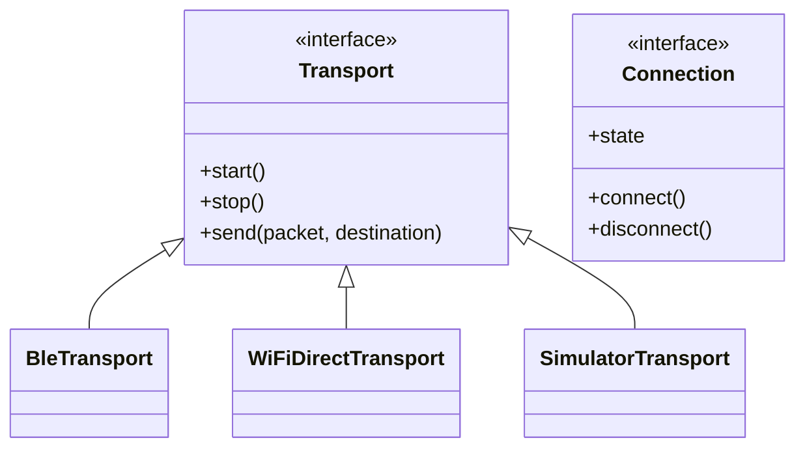

# Networking & Transport

Mesh Link V3.0 supports multiple physical transports behind a unified abstraction layer, enabling seamless roaming and multi-bearer mesh networks.

## Transport Abstraction

The Transport layer abstracts the physical medium into a set of common interfaces: `Transport`, `Connection`, and `Discovery`.

## BLE Transport

Bluetooth Low Energy is the primary transport for low-power, short-range mesh connectivity.

*   **Roles:** Devices act simultaneously as Broadcasters, Observers, Peripherals, and Central devices.
*   **GATT:** Uses a custom GATT service for high-throughput data transfer.
*   **MTU:** Automatically negotiates the maximum MTU size (up to 512 bytes) on connection.

## Wi-Fi Direct Transport

Wi-Fi Direct provides high-bandwidth point-to-point links for large payload transfers or bridge links between dense BLE clusters.

## Peer Discovery

1.  **Advertising:** Nodes broadcast periodic beacons containing a hashed node ID and current load metrics.
2.  **Scanning:** Nodes scan for beacons. When a valid beacon is found, it evaluates the link quality.
3.  **Connection Decision:** If the mesh topology requires a new link (e.g., low neighbor count), a connection is initiated.

## Connection Lifecycle

1.  **Discovery:** Peer found via scanning.
2.  **Connecting:** Transport-specific connection negotiation (e.g., BLE GATT connection).
3.  **Handshake:** Mesh Link session establishment and capability exchange.
4.  **Connected:** Ready for data routing.
5.  **Disconnected:** Triggered by link loss, timeouts, or manual closure.

## Message Flow (Transport Level)

1.  **Serialization:** The routing packet is serialized into a byte array.
2.  **Fragmentation:** If the payload exceeds the MTU (e.g., BLE without Data Length Extension), the transport layer fragments the packet.
3.  **Transmission:** Bytes are written to the characteristic/socket.
4.  **Reassembly:** The receiving transport reassembles fragments before passing the packet up to the Routing layer.
