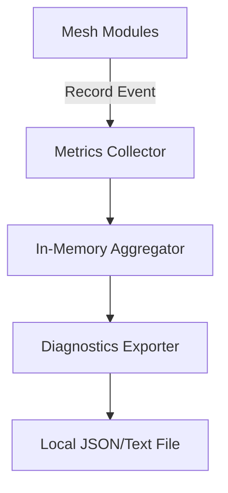

# Observability Framework

Mesh Link V3.0 features a comprehensive observability stack, encompassing structured logging, a metrics framework, and diagnostics exporting. Crucially, the system operates under a strict **no-telemetry** policy: no data is ever sent to external cloud services.

## Logging Framework

The logging framework (`com.meshlink.logging`) provides structured, non-blocking logs.

*   **Structured Format:** Logs are stored as structured objects (e.g., JSON), allowing complex queries during debugging.
*   **Correlation IDs:** All operations spanning multiple layers (e.g., API -> Routing -> Transport) share a unique `correlationId` to trace the entire lifecycle of an event.

```mermaid
graph LR
    API[API Layer] -->|correlationId=xyz| Routing[Routing Layer]
    Routing -->|correlationId=xyz| Transport[Transport Layer]
    
    API -.-> Logger
    Routing -.-> Logger
    Transport -.-> Logger
```

## Metrics Framework

The metrics framework (`com.meshlink.metrics`) provides real-time insights into system health with negligible overhead.

*   **Counters:** Used for monotonic values (e.g., `bytes_sent`, `messages_routed`).
*   **Gauges:** Used for point-in-time values (e.g., `active_connections`, `routing_table_size`).
*   **Timers:** Used for measuring durations (e.g., `handshake_latency`, `route_discovery_time`).
*   **Histograms:** For understanding the distribution of values (e.g., `rssi_distribution`).

## Diagnostics

The `DiagnosticsExporter` periodically snapshots the current metrics state. These snapshots can be exported locally by the developer for analysis. They contain aggregated data that helps identify memory leaks, routing loops, or connection instability without compromising user privacy.

## Health Monitoring

The system continuously monitors link stability and routing performance. If error rates exceed defined thresholds (e.g., excessive retransmissions or frequent disconnects), the health monitor can trigger a transport restart or force a new route discovery.
