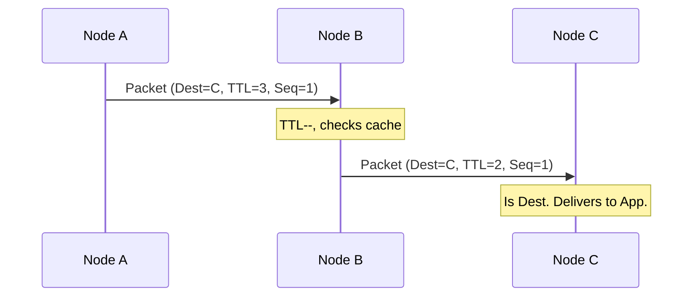

# Routing Layer

The routing layer in Mesh Link V3.0 is responsible for delivering packets from a source node to a destination node across multiple hops.

## Route Discovery

Mesh Link uses a reactive routing protocol (similar to AODV).

1.  **Route Request (RREQ):** When a node needs to send a message to an unknown destination, it broadcasts an RREQ.
2.  **Route Reply (RREP):** The destination (or an intermediate node with a fresh route) responds with a unicast RREP back to the source.
3.  **Caching:** Nodes cache routes in a routing table for future use.

## Route Scoring

Routes are scored based on multiple metrics:
*   **Hop Count:** Fewer hops are preferred.
*   **Link Quality (RSSI):** Links with stronger signals are prioritized.
*   **Node Load:** Derived from metrics; avoids routing through congested nodes.

## Multi-hop Forwarding

When a node receives a packet where it is not the destination:
1.  **TTL Check:** Decrements TTL. If TTL == 0, drop the packet.
2.  **Deduplication:** Checks the `(Source ID, Sequence Number)` against the recent packet cache. If seen, drop.
3.  **Routing Table Lookup:** Finds the next hop for the destination.
4.  **Forwarding:** Sends the packet to the next hop via the Transport layer.

## Duplicate Suppression

To prevent broadcast storms, every node maintains an LRU cache of recently seen packets identified by their `SourceAddress` and `SequenceNumber`. If a packet is received that is already in the cache, it is immediately discarded.

## Store-and-Forward

For intermittent connections, nodes can buffer packets. If a route to the destination is lost, the packet remains in the queue (until a timeout expires) while a new Route Discovery is initiated.

## Route Recovery

If a link breaks while forwarding a packet, the node will generate a Route Error (RERR) packet sent back to the source, prompting the source to initiate a new route discovery.

## TTL Handling

Every packet has a Time-To-Live (TTL). The default TTL is configurable (usually 10). It is decremented at each hop to prevent infinite routing loops.
