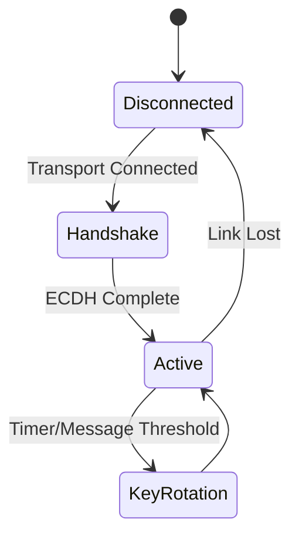

# Security Architecture

Mesh Link V3.0 provides robust, end-to-end security for all communications.

## Security Assumptions and Threat Model

*   **Untrusted Relays:** Intermediate nodes forwarding traffic cannot read the payload or tamper with the routing headers without detection.
*   **Threats Mitigated:** Eavesdropping, Man-in-the-Middle (MitM), Replay attacks, and Downgrade attacks.
*   **Out-of-Scope:** Physical compromise of the device, Denial of Service (DoS) via RF jamming.

## Encryption

*   **Algorithm:** AES-256-GCM (Galois/Counter Mode).
*   **End-to-End:** Payloads are encrypted at the source and decrypted at the destination. Intermediate routing nodes only see the routing header.
*   **Integrity:** GCM provides authentication tags to ensure the payload has not been modified.

## Session Lifecycle and Key Exchange

1.  **Key Exchange:** Uses Elliptic Curve Diffie-Hellman (ECDH) on Curve25519 for establishing a shared secret.
2.  **Session Establishment:** Once a shared secret is computed, an active session is created.
3.  **Session Expiry:** Sessions rotate keys periodically or after a certain threshold of messages to maintain forward secrecy.

## Replay Protection

Replay attacks are prevented using a sliding window protocol combined with strictly increasing Nonces.

*   **Nonce:** Each message uses a unique, incrementing 64-bit Nonce.
*   **Validation:** The receiver rejects any message with a Nonce lower than or equal to the highest previously verified Nonce from that sender.

## Downgrade Protection

During the handshake, devices advertise their supported security protocol versions. The negotiated version is cryptographically bound into the key derivation function (KDF). If an attacker intercepts and modifies the plaintext capability advertisement to force a lower security version, the derived keys will not match, and the handshake will fail.
